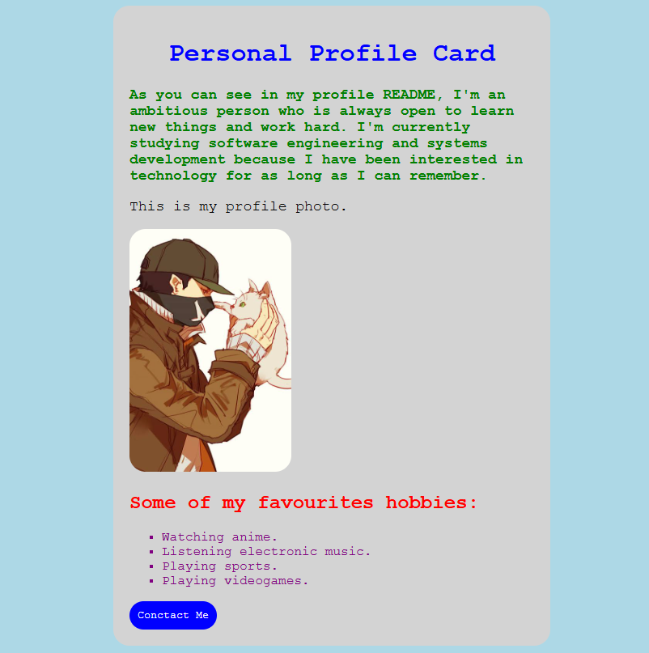

# 🎨 Personal Profile Card

A beginner HTML & CSS project created as practice while learning the fundamentals of web development.

## 📖 About

This project consists of a simple **Personal Profile Card** built using HTML and CSS. The goal was to practice basic web development concepts such as:

* HTML structure
* CSS element selectors
* CSS class selectors
* CSS ID selectors

## ✨ Features

* Personal profile section
* Profile image
* Hobby list
* Styled button
* Custom typography
* Card layout with rounded corners
* Organized and readable code

## 🛠️ Technologies Used

* HTML5
* CSS3

## 📚 Concepts Practiced

### HTML

* `div`
* `h1`
* `h2`
* `p`
* `img`
* `ul`
* `li`
* `button`

### CSS

* Element selectors
* Class selectors
* ID selectors
* Universal selector (`*`)
* Colors
* Font styling
* Padding
* Border radius
* Width and height
* Lists

## 🚀 What I Learned

Through this project, I learned how to:

* Structure a webpage with semantic HTML.
* Connect an external CSS stylesheet.
* Style elements using element, class, and ID selectors.
* Organize CSS into reusable classes.
* Apply spacing, colors, typography, and basic layout styling.
* Write cleaner and more readable HTML and CSS code.

## 📸 Preview

